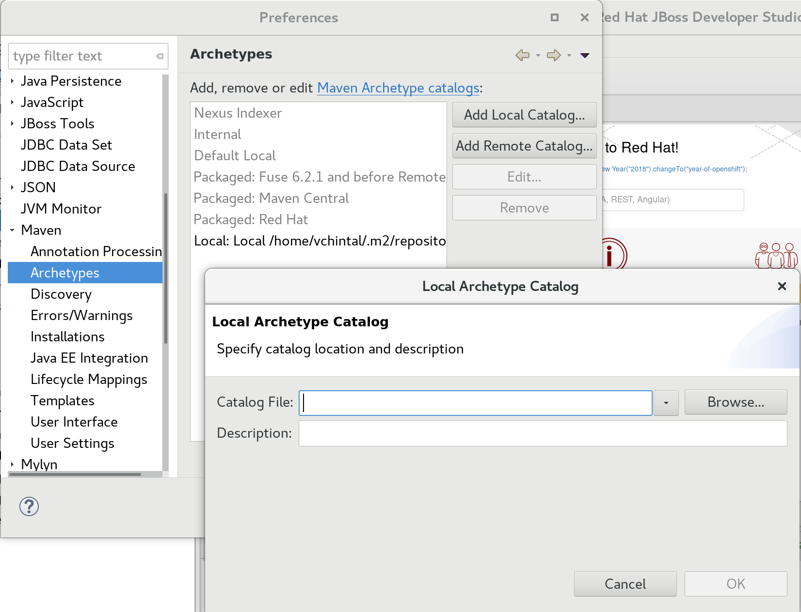

# Initial Setup

Git clone the repo [https://github.com/vchintal/jboss-middleware-archetypes.git](https://github.com/vchintal/jboss-middleware-archetypes) either from command-line or use JBoss Developer Studio to clone the project into your workspace.

### From Command-Line

```bash
 git clone https://github.com/vchintal/jboss-middleware-archetypes.git
```

### From JBoss Developer Studio

1. Using the menu, choose File 🡒 Import 🡒 Maven 🡒 Checkout Maven Projects from SCM
2. Copy-paste the above URL, click next till the end
3. Right-click on **jboss-middleware-archetypes**, choose Run As 🡒 6 Maven Install

Follow the instructions below to further run setup instructions based on the operational mode of your choice.

### Cataloging the Archetypes

In some circumstances, the archetypes are installed but not cataloged and hence the JBoss Developer Studio \(JBDS\) cannot find them. If JBDS cannot find the archetypes, you cannot create a project from them using it. So here is some workaround:

1. Run the command `mvn archetype:crawl` on the command line
2. It should create a file `~/.m2/repository/archetype-catalog.xml` . That is, on my system it created `/home/vchintal/.m2/repository/archetype-catalog.xml`. Make a note of it and move to next step
3. Using JBDS, navigate to, Window 🡒 Preferences 🡒 Maven 🡒 Archetypes 🡒 Add Local Catalog. Paste the full path to your archetype-catalog.xml and save it



